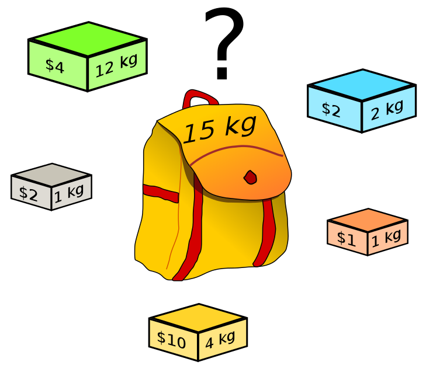
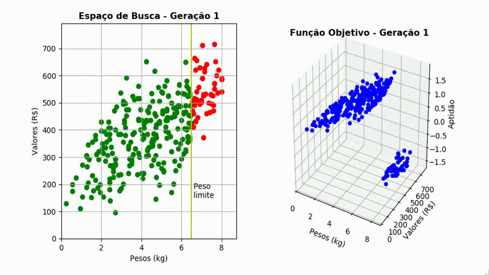
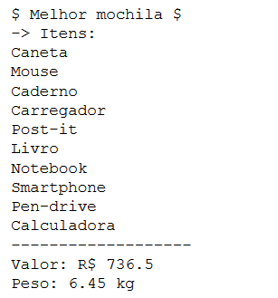

# Problema da Mochila Binária

O problema da mochila (em inglês, Knapsack problem) é um problema de **otimização combinatória**. O nome dá-se devido ao modelo de uma situação em que é necessário preencher uma mochila com objetos de diferentes _pesos_ e _valores_. O objetivo é que se preencha a mochila com o maior valor possível, não ultrapassando o peso máximo suportado pela mochila.

O problema da mochila é um dos 21 problemas NP-completos de Richard Karp, exposto em 1972. A formulação do problema é extremamente simples, porém sua solução é mais complexa. Este problema é a base do primeiro algoritmo de chave pública (chaves assimétricas).

Normalmente este problema é resolvido com programação dinâmica, obtendo então a resolução exata do problema, mas também sendo possível usar PSE (procedimento de separação e evolução). Existem também outras técnicas, como usar algoritmo guloso, meta-heurística (**algoritmos genéticos**) para soluções aproximadas. 

Aqui, utilizaremos um algoritmo genético simples para tentar resolver o problema.

É possível acompanhar a evolução das gerações ao longo da execução do programa, como ilustrado a seguir.

Ao final, a melhor mochila é exibida.

> Computadores fazem arte, artistas fazem dinheiro.

<!--stackedit_data:
eyJoaXN0b3J5IjpbLTE0MTc2MzU0ODQsLTgzMTg2OTQyOSwtNz
ExODU0MzMxXX0=
-->
